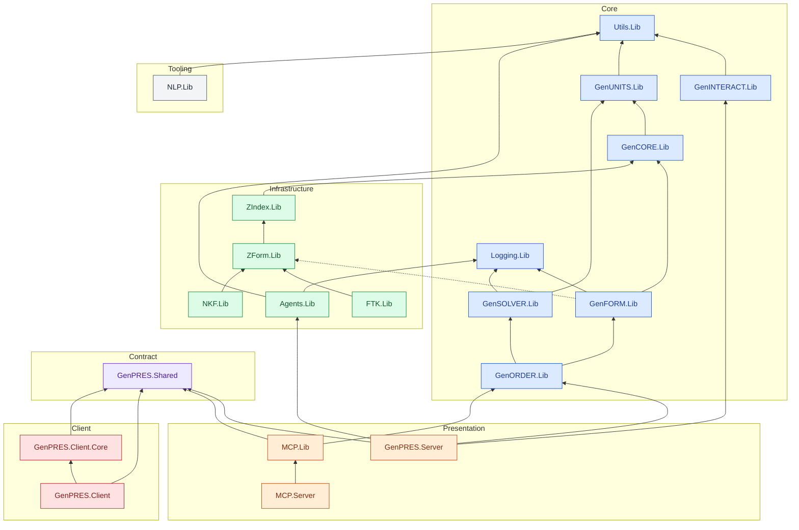
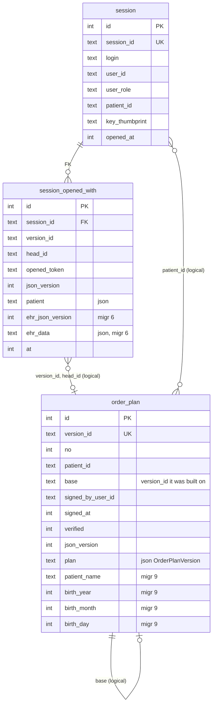
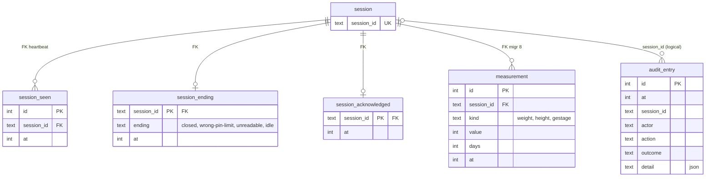
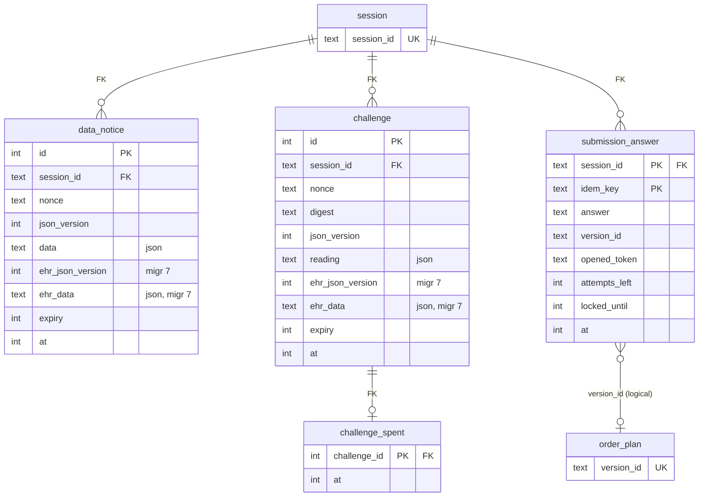
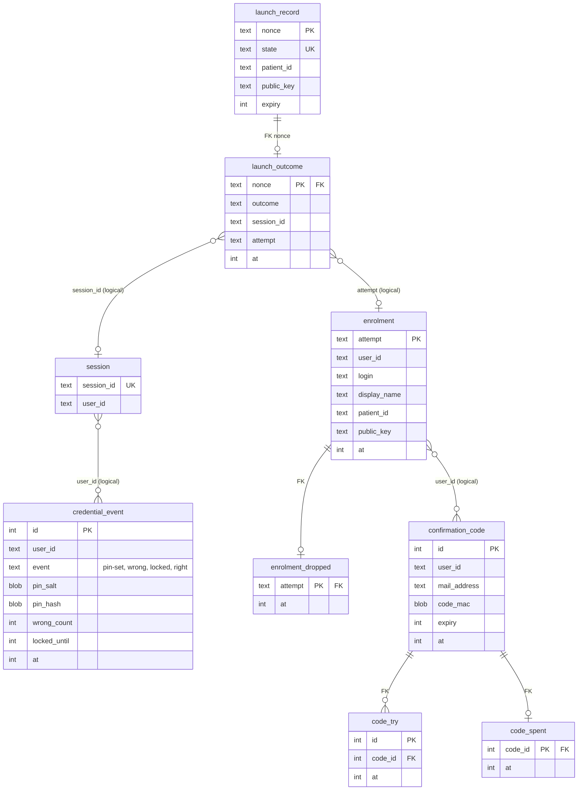

# GenPRES Architecture Overview

This file is an **index and landing page** for the architecture documentation. It provides a stable entry point; the detailed material lives under `docs/`:

- [`docs/adr/0001-system-architecture.md`](docs/adr/0001-system-architecture.md) – the foundational architecture decision (SAFE Stack, all-F#, spreadsheet-backed rules, Docker delivery)
- [`docs/adr/`](docs/adr/) – all Architecture Decision Records; [ADR-0000](docs/adr/0000-documentation-rules.md) states when one is written
- [`docs/domain/`](docs/domain/) – the domain model: [Core Domain](docs/domain/core-domain.md), GenFORM, GenORDER and GenSOLVER specifications
- [`docs/README.md`](docs/README.md) – the map of the documentation folder

Build, run and toolchain details are in [`DEVELOPMENT.md`](DEVELOPMENT.md).

## Project dependencies

Every project under `src/`, grouped by the ring that
[ADR-0001](docs/adr/0001-system-architecture.md#dependency-rule-and-effects--amended-2026-09-06) assigns it. The
block below is generated by `scripts/ProjectGraph.fsx` from the `.fsproj` files and the ring map in
`scripts/DependencyRule.fsx`, and CI fails when it is out of date; refresh it with
`dotnet fsi scripts/ProjectGraph.fsx --write`.

<!-- project-graph:start -->
<!-- Generated by `dotnet fsi scripts/ProjectGraph.fsx --write`; do not edit by hand. -->

20 projects, 27 project references. An arrow points at the dependency. A dashed arrow is an
outward reference the dependency rule still tolerates; the reasons are in `scripts/DependencyRule.fsx`.
<!-- project-graph:end -->

## Database Schema

The SQLite session and record store, abbreviated: each table shows its keys and main columns, and
the labels say which relations are declared foreign keys and which are joins by id. The full
schema is the migrations in `src/Informedica.GenPRES.Server/Sql/`, applied in order. Every table
only gains rows; where a Session or a credential has a history, the newest row counts.

The store is drawn in four parts. `session` and `order_plan` appear in more than one, with only
the columns the part joins on.

### The record and what a Session opens with

### A Session's life

### Signing

### Launch, credentials and enrolment

