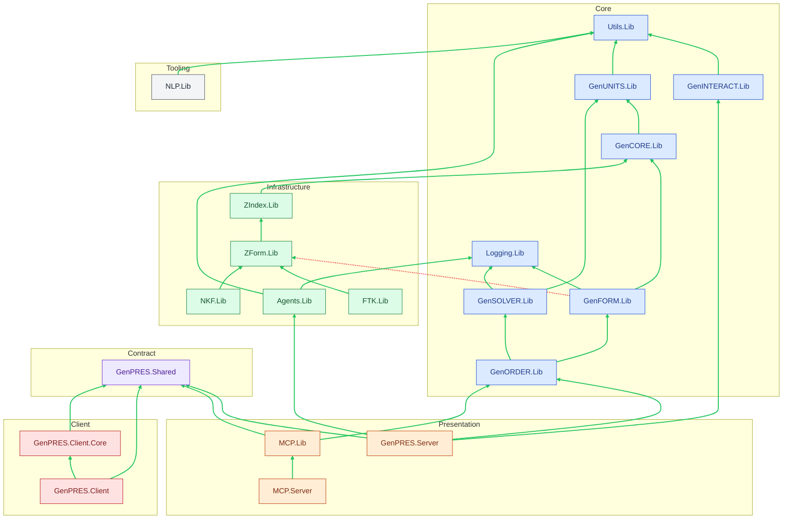
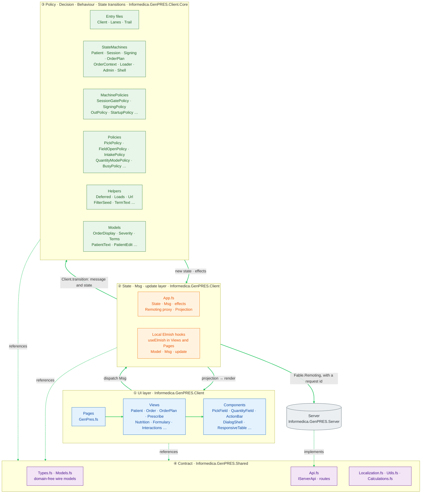
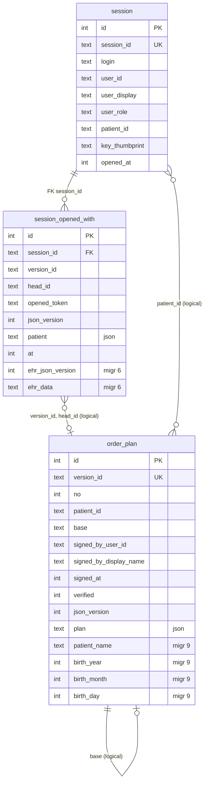
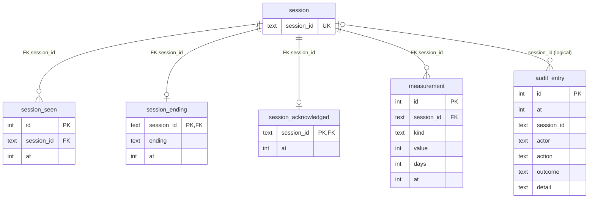
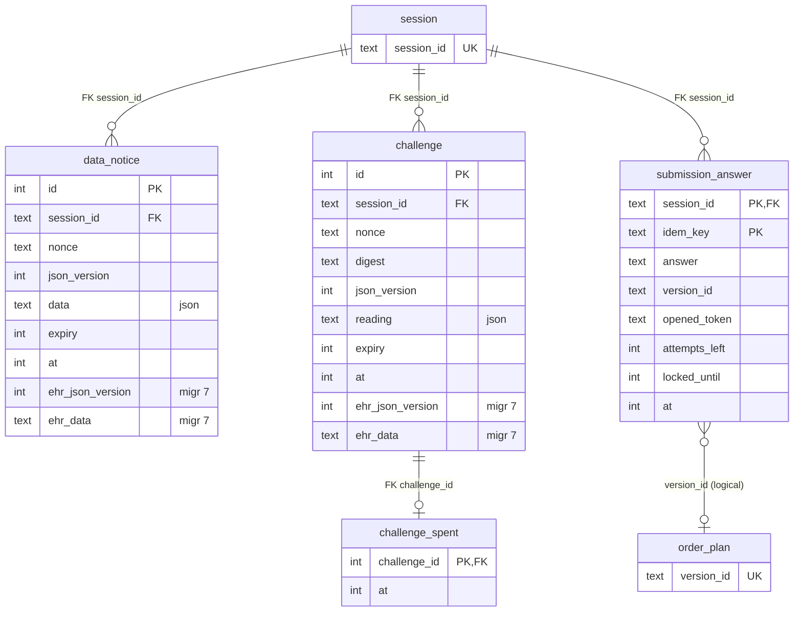
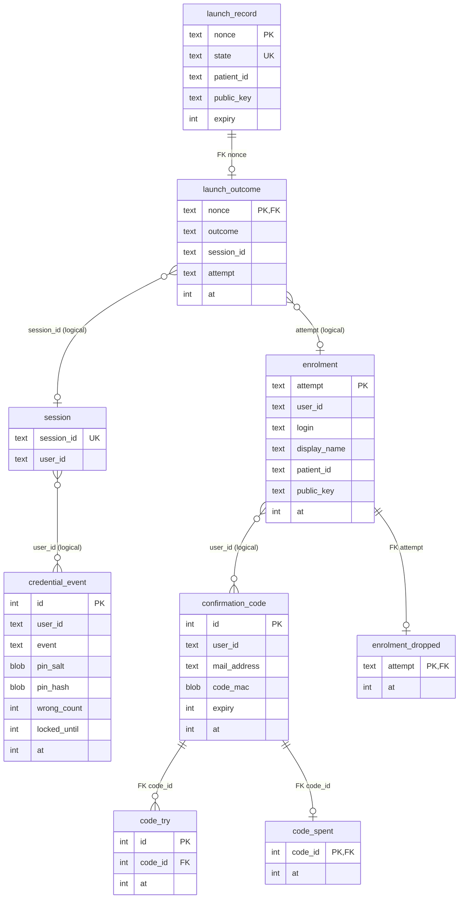

# GenPRES Architecture Overview

This file is an **index and landing page** for the architecture documentation. It provides a stable entry point; the detailed material lives under `docs/`:

- [`docs/adr/0001-system-architecture.md`](docs/adr/0001-system-architecture.md) – the foundational architecture decision (SAFE Stack, all-F#, spreadsheet-backed rules, Docker delivery)
- [`docs/adr/`](docs/adr/) – all Architecture Decision Records; [ADR-0000](docs/adr/0000-documentation-rules.md) states when one is written
- [`docs/domain/`](docs/domain/) – the domain model: [Core Domain](docs/domain/core-domain.md), GenFORM, GenORDER and GenSOLVER specifications
- [`docs/README.md`](docs/README.md) – the map of the documentation folder

Build, run and toolchain details are in [`DEVELOPMENT.md`](DEVELOPMENT.md).

## Project dependencies

Every project under `src/`, grouped by the ring that
[ADR-0001](docs/adr/0001-system-architecture.md#dependency-rule-and-effects--amended-2026-09-06) assigns it. The
block below is generated by `scripts/ProjectGraph.fsx` from the `.fsproj` files and the ring map in
`scripts/DependencyRule.fsx`, and CI fails when it is out of date; refresh it with
`dotnet fsi scripts/ProjectGraph.fsx --write`.

<!-- project-graph:start -->
<!-- Generated by `dotnet fsi scripts/ProjectGraph.fsx --write`; do not edit by hand. -->

```mermaid
graph BT
    subgraph Core
        GenCORE_Lib["GenCORE.Lib"]
        GenFORM_Lib["GenFORM.Lib"]
        GenINTERACT_Lib["GenINTERACT.Lib"]
        GenORDER_Lib["GenORDER.Lib"]
        GenSOLVER_Lib["GenSOLVER.Lib"]
        GenUNITS_Lib["GenUNITS.Lib"]
        Logging_Lib["Logging.Lib"]
        Utils_Lib["Utils.Lib"]
    end
    subgraph Contract
        GenPRES_Shared["GenPRES.Shared"]
    end
    subgraph Infrastructure
        Agents_Lib["Agents.Lib"]
        FTK_Lib["FTK.Lib"]
        NKF_Lib["NKF.Lib"]
        ZForm_Lib["ZForm.Lib"]
        ZIndex_Lib["ZIndex.Lib"]
    end
    subgraph Presentation
        GenPRES_Server["GenPRES.Server"]
        MCP_Lib["MCP.Lib"]
        MCP_Server["MCP.Server"]
    end
    subgraph Client
        GenPRES_Client["GenPRES.Client"]
        GenPRES_Client_Core["GenPRES.Client.Core"]
    end
    subgraph Tooling
        NLP_Lib["NLP.Lib"]
    end
    GenCORE_Lib --> GenUNITS_Lib
    GenFORM_Lib --> GenCORE_Lib
    GenFORM_Lib --> Logging_Lib
    GenFORM_Lib -.-> ZForm_Lib
    GenINTERACT_Lib --> Utils_Lib
    GenORDER_Lib --> GenSOLVER_Lib
    GenORDER_Lib --> GenFORM_Lib
    GenSOLVER_Lib --> GenUNITS_Lib
    GenSOLVER_Lib --> Logging_Lib
    GenUNITS_Lib --> Utils_Lib
    Agents_Lib --> Utils_Lib
    Agents_Lib --> Logging_Lib
    FTK_Lib --> ZForm_Lib
    NKF_Lib --> ZForm_Lib
    ZForm_Lib --> ZIndex_Lib
    ZIndex_Lib --> GenCORE_Lib
    GenPRES_Server --> GenPRES_Shared
    GenPRES_Server --> GenORDER_Lib
    GenPRES_Server --> GenINTERACT_Lib
    GenPRES_Server --> Agents_Lib
    MCP_Lib --> GenORDER_Lib
    MCP_Lib --> GenPRES_Shared
    MCP_Server --> MCP_Lib
    GenPRES_Client --> GenPRES_Client_Core
    GenPRES_Client --> GenPRES_Shared
    GenPRES_Client_Core --> GenPRES_Shared
    NLP_Lib --> Utils_Lib
    classDef Core fill:#dbeafe,stroke:#1d4ed8,color:#1e3a8a
    class GenCORE_Lib,GenFORM_Lib,GenINTERACT_Lib,GenORDER_Lib,GenSOLVER_Lib,GenUNITS_Lib,Logging_Lib,Utils_Lib Core
    classDef Contract fill:#ede9fe,stroke:#6d28d9,color:#4c1d95
    class GenPRES_Shared Contract
    classDef Infrastructure fill:#dcfce7,stroke:#15803d,color:#14532d
    class Agents_Lib,FTK_Lib,NKF_Lib,ZForm_Lib,ZIndex_Lib Infrastructure
    classDef Presentation fill:#ffedd5,stroke:#c2410c,color:#7c2d12
    class GenPRES_Server,MCP_Lib,MCP_Server Presentation
    classDef Client fill:#fee2e2,stroke:#b91c1c,color:#7f1d1d
    class GenPRES_Client,GenPRES_Client_Core Client
    classDef Tooling fill:#f3f4f6,stroke:#4b5563,color:#1f2937
    class NLP_Lib Tooling
    linkStyle default stroke:#22c55e,stroke-width:2px
    linkStyle 3 stroke:#ef4444,stroke-width:2px
```

20 projects, 27 project references. An arrow points at the dependency. A green arrow points
inward, as the dependency rule wants. A dashed red arrow is an outward reference the rule still tolerates but that should
not exist; the reasons are in `scripts/DependencyRule.fsx`.
<!-- project-graph:end -->

## Client architecture

The client is layered in four layers, each with its own purpose:

| Layer (diagram) | Project | Responsibility | Key modules | References | Tested with |
| --- | --- | --- | --- | --- | --- |
| ① UI | `Informedica.GenPRES.Client` | Renders what the projection gives it and dispatches messages on user input; holds no decisions | `Pages/GenPres.fs`, `Views/*` (Patient, Order, OrderPlan, Prescribe, Nutrition …), `Components/*` (PickField, QuantityField, ActionBar …) | ② State · Msg · update, ③ Client.Core (read-only: models, policy queries), ④ Contract | Browser |
| ② State · Msg · update | `Informedica.GenPRES.Client` | Runs the Elmish program over `Client.transition`, carries out the effects that leave the client, calls the server through Fable.Remoting, and gives the views their projection through the `AppEnv` interfaces | `App.fs` (State, Msg, effects, Remoting proxy, `Projection`), `Main.fs`, `StepTrail.fs`, local `useElmish` hooks in `GenPres.fs`, `Order.fs`, `NutritionSlot.fs` and `Interactions.fs` | ③ Client.Core, ④ Contract | Browser |
| ③ Policy · Decision · Behaviour · State transitions | `Informedica.GenPRES.Client.Core` | Decides what is allowed and what comes next as pure F#: no React, no Browser types, no Fable packages | Entry files: `Client`, `Lanes`, `Trail`; the rest by kind, see [Inside Client.Core](#inside-clientcore) | ④ Contract only | Expecto, FSI |
| ④ Contract | `Informedica.GenPRES.Shared` | Defines the wire models and the API contract shared by client and server | `Types.fs`, `Models.fs`, `Api.fs` (`IServerApi`, routes), `Localization.fs`, `Utils.fs`, `Calculations.fs` | Nothing | Expecto, FSI |

The circled numbers match the boxes in the diagram below. Solid arrows show the runtime flow and
dotted arrows show compile-time references. A layer references only layers further down the table,
and only layer ② talks to the server. Every arrow is green: none goes outward.

```mermaid
flowchart TB
    subgraph UI["① UI layer · Informedica.GenPRES.Client"]
        direction LR
        Pages["Pages<br/>GenPres.fs"]
        Views["Views<br/>Patient · Order · OrderPlan · Prescribe<br/>Nutrition · Formulary · Interactions …"]
        Comps["Components<br/>PickField · QuantityField · ActionBar<br/>DialogShell · ResponsiveTable …"]
        Pages --> Views --> Comps
    end

    subgraph ELM["② State · Msg · update layer · Informedica.GenPRES.Client"]
        direction LR
        App["App.fs<br/>State · Msg · effects<br/>Remoting proxy · Projection"]
        Local["Local Elmish hooks<br/>useElmish in Views and Pages<br/>Model · Msg · update"]
    end

    subgraph CORE["③ Policy · Decision · Behaviour · State transitions · Informedica.GenPRES.Client.Core"]
        direction LR
        Entry["Entry files<br/>Client · Lanes · Trail"]
        Machines["StateMachines<br/>Patient · Session · Signing · OrderPlan<br/>OrderContext · Loader · Admin · Shell"]
        MPolicies["MachinePolicies<br/>SessionGatePolicy · SigningPolicy<br/>OutPolicy · StartupPolicy …"]
        Policies["Policies<br/>PickPolicy · FieldOpenPolicy · IntakePolicy<br/>QuantityModePolicy · BusyPolicy …"]
        Helpers["Helpers<br/>Deferred · Loads · Url<br/>FilterSeed · TermText …"]
        Models["Models<br/>OrderDisplay · Severity · Terms<br/>PatientText · PatientEdit …"]
    end

    subgraph SHARED["④ Contract · Informedica.GenPRES.Shared"]
        direction LR
        Types["Types.fs · Models.fs<br/>domain-free wire models"]
        Api["Api.fs<br/>IServerApi · routes"]
        Loc["Localization.fs · Utils.fs · Calculations.fs"]
    end

    Server[("Server<br/>Informedica.GenPRES.Server")]

    UI -- "dispatch Msg" --> ELM
    ELM -- "projection → render" --> UI
    ELM -- "Client.transition: message and state" --> CORE
    CORE -- "new state · effects" --> ELM
    ELM -- "Fable.Remoting, with a request id" --> Server
    Server -. "implements" .-> Api

    UI -. "references" .-> SHARED
    ELM -. "references" .-> SHARED
    CORE -. "references" .-> SHARED

    classDef ui fill:#e3f2fd,stroke:#1565c0,color:#0d47a1
    classDef elm fill:#fff3e0,stroke:#ef6c00,color:#e65100
    classDef core fill:#e8f5e9,stroke:#2e7d32,color:#1b5e20
    classDef shared fill:#f3e5f5,stroke:#6a1b9a,color:#4a148c
    classDef srv fill:#eceff1,stroke:#455a64,color:#263238
    class Pages,Views,Comps ui
    class App,Local elm
    class Entry,Machines,MPolicies,Policies,Helpers,Models core
    class Types,Api,Loc shared
    class Server srv
    linkStyle default stroke:#22c55e,stroke-width:2px
```

### Inside Client.Core

Layer ③ is organised by kind. Each folder is a namespace `Informedica.GenPRES.Client.Core.<Folder>`,
compiled in the order of the table, and a file uses only its own kind or a kind above it in the
table. The entry files sit at the project root, in the root namespace.

| Kind | Holds | Examples |
| --- | --- | --- |
| Models | the code from Shared that only the client uses; it reads only Shared | `OrderDisplay`, `Severity`, `PatientText`, `PatientEdit`, `Terms` |
| Helpers | values and functions without a decision of their own | `Deferred`, `Loads`, `Url`, `FilterSeed`, `TermText` |
| Policies | pure decisions over the contract, each named `*Policy` | `PickPolicy`, `FieldOpenPolicy`, `BusyPolicy`, `UrlPolicy` |
| StateMachines | one state, message and effect type per machine, and a transition to a new state and its effects | `PatientMachine`, `OrderContextMachine`, `ShellMachine` |
| MachinePolicies | decisions that read the state of one or more machines | `SessionGatePolicy`, `SigningPolicy`, `OutPolicy`, `StartupPolicy` |
| Entry files | `Lanes` wires the patient, workbench, plan, Session and signing machines; `Client` wires the lanes with the loader, admin and shell machines into one pure transition; `Trail` describes each step as one line, for development | `Lanes`, `Client`, `Trail` |

A message runs the part it is for, or becomes a message for a part, and an effect that another part
acts on is passed on to that part in the same transition. Every effect still comes out, in the
order the parts emitted it, and layer ② carries out what leaves the client. Code opens the folder
namespaces, never the root namespace, and reaches a root file through a module alias such as
`module Client = Informedica.GenPRES.Client.Core.Client`.

### Testing

- Layers ③ and ④ are plain F# and are tested with Expecto, in
  `tests/Informedica.GenPRES.Client.Core.Tests` and `tests/Informedica.GenPRES.Shared.Tests`, and
  explored in FSI: the behaviour and the state transitions of the client.
- Layers ① and ② depend on Fable and React, so they are not tested in .NET. They are checked in the
  browser, with the development trail of `StepTrail` and `Trail` (see
  [DEVELOPMENT.md](DEVELOPMENT.md)). Automated tests for them are not in place yet.

## Database Schema

The SQLite session and record store, every table and column of the migrations in
`src/Informedica.GenPRES.Server/Sql/`, applied in order. A column added by a later migration
says which one; a relation labelled FK is a declared foreign key, one labelled logical a join by
id. Every table only gains rows; where a Session or a credential has a history, the newest row
counts.

The store is drawn in four parts. `session` and `order_plan` appear in more than one, with only
the columns the part joins on. The block below is generated by `scripts/SchemaDiagram.fsx` from
the migrations and the parts it names, and CI fails when it is out of date; refresh it with
`dotnet fsi scripts/SchemaDiagram.fsx --write`.

<!-- db-schema:start -->
<!-- Generated by `dotnet fsi scripts/SchemaDiagram.fsx --write`; do not edit by hand. -->

### The record and what a Session opens with

```mermaid
erDiagram
    order_plan {
        int id PK
        text version_id UK
        int no
        text patient_id
        text base
        text signed_by_user_id
        text signed_by_display_name
        int signed_at
        int verified
        int json_version
        text plan "json"
        text patient_name "migr 9"
        int birth_year "migr 9"
        int birth_month "migr 9"
        int birth_day "migr 9"
    }
    session {
        int id PK
        text session_id UK
        text login
        text user_id
        text user_display
        text user_role
        text patient_id
        text key_thumbprint
        int opened_at
    }
    session_opened_with {
        int id PK
        text session_id FK
        text version_id
        text head_id
        text opened_token
        int json_version
        text patient "json"
        int at
        int ehr_json_version "migr 6"
        text ehr_data "migr 6"
    }
    session ||--o{ session_opened_with : "FK session_id"
    order_plan ||--o| order_plan : "base (logical)"
    session_opened_with }o--o| order_plan : "version_id, head_id (logical)"
    session }o--o{ order_plan : "patient_id (logical)"
```

### A Session's life

```mermaid
erDiagram
    session {
        text session_id UK
    }
    session_seen {
        int id PK
        text session_id FK
        int at
    }
    session_ending {
        text session_id PK, FK
        text ending
        int at
    }
    session_acknowledged {
        text session_id PK, FK
        int at
    }
    audit_entry {
        int id PK
        int at
        text session_id
        text actor
        text action
        text outcome
        text detail
    }
    measurement {
        int id PK
        text session_id FK
        text kind
        int value
        int days
        int at
    }
    session ||--o{ session_seen : "FK session_id"
    session ||--o| session_ending : "FK session_id"
    session ||--o| session_acknowledged : "FK session_id"
    session ||--o{ measurement : "FK session_id"
    session |o--o{ audit_entry : "session_id (logical)"
```

### Signing

```mermaid
erDiagram
    order_plan {
        text version_id UK
    }
    session {
        text session_id UK
    }
    data_notice {
        int id PK
        text session_id FK
        text nonce
        int json_version
        text data "json"
        int expiry
        int at
        int ehr_json_version "migr 7"
        text ehr_data "migr 7"
    }
    challenge {
        int id PK
        text session_id FK
        text nonce
        text digest
        int json_version
        text reading "json"
        int expiry
        int at
        int ehr_json_version "migr 7"
        text ehr_data "migr 7"
    }
    challenge_spent {
        int challenge_id PK, FK
        int at
    }
    submission_answer {
        text session_id PK, FK
        text idem_key PK
        text answer
        text version_id
        text opened_token
        int attempts_left
        int locked_until
        int at
    }
    session ||--o{ data_notice : "FK session_id"
    session ||--o{ challenge : "FK session_id"
    challenge ||--o| challenge_spent : "FK challenge_id"
    session ||--o{ submission_answer : "FK session_id"
    submission_answer }o--o| order_plan : "version_id (logical)"
```

### Launch, credentials and enrolment

```mermaid
erDiagram
    launch_record {
        text nonce PK
        text state UK
        text patient_id
        text public_key
        int expiry
    }
    launch_outcome {
        text nonce PK, FK
        text outcome
        text session_id
        text attempt
        int at
    }
    session {
        text session_id UK
        text user_id
    }
    credential_event {
        int id PK
        text user_id
        text event
        blob pin_salt
        blob pin_hash
        int wrong_count
        int locked_until
        int at
    }
    confirmation_code {
        int id PK
        text user_id
        text mail_address
        blob code_mac
        int expiry
        int at
    }
    code_try {
        int id PK
        int code_id FK
        int at
    }
    code_spent {
        int code_id PK, FK
        int at
    }
    enrolment {
        text attempt PK
        text user_id
        text login
        text display_name
        text patient_id
        text public_key
        int at
    }
    enrolment_dropped {
        text attempt PK, FK
        int at
    }
    launch_record ||--o| launch_outcome : "FK nonce"
    confirmation_code ||--o{ code_try : "FK code_id"
    confirmation_code ||--o| code_spent : "FK code_id"
    enrolment ||--o| enrolment_dropped : "FK attempt"
    launch_outcome }o--o| session : "session_id (logical)"
    launch_outcome }o--o| enrolment : "attempt (logical)"
    session }o--o{ credential_event : "user_id (logical)"
    enrolment }o--o{ confirmation_code : "user_id (logical)"
```

<!-- db-schema:end -->
