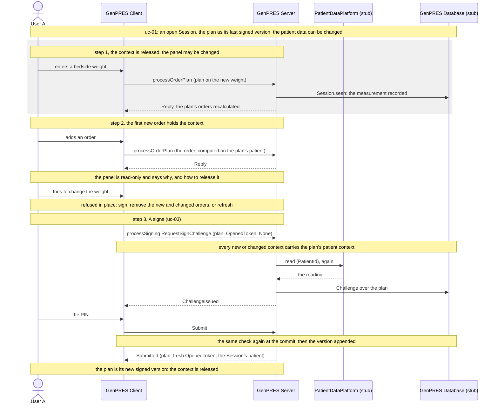

# The patient context is held while the plan has new or changed orders

UC-12. User A prescribes for a Patient, and every order they add is computed on the patient
context of that moment: weight, height, gestational age, department, renal function, access,
and the age. Today A can change that context after the first order is on the plan, and the
orders already there are recalculated or left as they were computed, while the plan's patient
follows the edit. So A can sign orders that were composed on different data. This page holds
the context from the first new or changed order to the sign, so that everything a signed version
adds rests on one patient context.

**Not built.** Unlike the other pages here, this one draws the design the code is to be built
to ([#1075](https://github.com/informedica/GenPRES/issues/1075)); what the code does today is
under [Today](#today).

Precondition: [uc-01](uc-01-launch.md) has left an open Session for the Patient, started from
the head of its record, with the Prescriber Role.

## Reading it

**Held by the plan, not by a clock or a row.** The context is held while the plan has a new or
changed order: one added, or changed, since the version last opened or signed. Only the order
plan is ever signed, as a version; an order is new or changed against that version. The orders
of the last signed version, loaded at the launch, hold nothing, so a launch on a patient with a
signed plan starts released. The hold is not a state the Server keeps: the Server keeps nothing
of the plan between requests (Rule 32). The Client derives it from the plan it holds, and the
Server derives the same fact from the plan it is asked to sign.

**The Client informs, the Server enforces.** The panel goes read-only while the context is
held, and says so, with the three ways out. That is a courtesy. The rule is the Server's:
every plan context carries the patient it was computed on (`PlanContext.Context.Patient`), and
at the challenge and again at the commit the Server refuses a plan whose new or changed contexts
carry another patient context than the plan's own. A plan that reaches the signature with
orders composed on different data is refused whatever the Client did.

**Released three ways.** By the sign: the plan is the new version, nothing in it is new or
changed. By removing every new and changed order: the plan is back to the version it opened. By
a refresh: a new launch, an explicit refresh in GenPRES that reads the EHR again and drops the
new and changed
orders, or a browser reload, which drops them with the Client's state. A Session that ends
releases it too, idle ([#1061](https://github.com/informedica/GenPRES/issues/1061)) or
otherwise ([uc-08](uc-08-session-ends.md)).

**The age is one field of the context.** An identified patient's age is already held by the
Server from the open to the sign and put on every request
([plan for #976](../../implementation-plans/976-two-patient-modes.md)). The hold of this page
covers the fields the User can change; the age rule stands as it is.

**A bedside measurement waits for the release.** A weight measured while the context is held
cannot be entered until the plan is signed or its new and changed orders are dropped. That is
the clinical cost of the rule, accepted for the first build; re-prescribing the new and changed
orders on the new context is a follow-up (see [To settle](#to-settle)).

## What a signature can be refused with, beside uc-03's

| `SigningRefusal` | At | Means |
|------------------|----|-------|
| `ContextDiffers` | both | a new or changed order was computed on another patient context than the plan is signed on |

The Client shows it once and returns to the plan: the orders it names are the ones to remove or
prescribe again.

## Extensions

**12a A removes every new and changed order.** The plan is the version it opened with; the panel
is released at once.

**12b A refreshes.** GenPRES asks first: the new and changed orders are dropped. The Server
reads the EHR again, projects it at the date of the refresh, and the Session's patient becomes
that; the head's orders are recalculated on it.

**12c The EHR reads other data at the sign.** The data notice is shown as in uc-03, but the
version is signed on the held context and recorded as differing from the EHR (`Verified` false).
The new data applies from the next round, once the context is released.

**12d Two Users.** Each holds their own context in their own plan. The first to sign wins
([uc-04](uc-04-two-users.md)); the other rebuilds on the new head, and their new and changed
orders keep the context they were composed on until they sign or drop them.

**12e The Session ends while the context is held.** The new and changed orders go with the
Client state as they do today; the relaunch starts released.

## Today

A change to the patient context sends `PatientChanged` to the plan (`updatePatient` in
`App.fs`), and the plan recomputes its totals with the new patient; the contexts keep the
patient they were created with (`OrderPlanMachine.step`). The plan's patient, its totals and the
patient data of a signed version follow the edit, and nothing compares them with the patient of
each context. The accept of a data notice sets the draft to the notice's data, orders or not.
The Client tracks the plan's changes since its last signed version (`PlanWork` in
`PlanWorkPolicy.fs`), counted per plan, for the guard
that asks before leaving the page, not per order.

## Where this changes the design

- **Concept 15** makes prescribing change the Patient Data of the PatientContext freely within a
  Session. Under this page it does so only while the plan has no new or changed order.
- **Concept 16**, the WorkPlan, gains a state: held or released, derived from its orders.
- **Rule 44**, the data notice before the challenge: while the context is held the version is
  signed on the held context, not on the data as it stands.
- The model in [`Integration.fsx`](Integration.fsx) has prescribing change the patient data at
  any step; it has no hold.

## To settle

- **Which fields.** Default: every patient datum the rules read, the age included; the age is
  already held by the Server.
- **Which Sessions.** Default: every Session, identified and anonymous; the url mode without a
  Session is unchanged, since nothing is signed there.
- **Measurements.** Recorded per request as now; under the hold the panel sends none.
- **Re-prescribing on a new context.** A path that takes the new and changed orders to a new
  context instead of dropping them, which is the replacement
  [#672](https://github.com/informedica/GenPRES/issues/672) asks for signed contexts too.
- **How the version records** that it was signed on a context the EHR no longer reads: the
  `Verified` flag, or a field of its own.

## Not built

All of it: the hold in the Client, the read-only panel and its notice, the refresh, the check
at the challenge and the commit, and the refusal. The implementation plan is
[1075-held-patient-context.md](../../implementation-plans/1075-held-patient-context.md).

---

Read off `updatePatient` in `src/Informedica.GenPRES.Client/App.fs`, `OrderPlanMachine.fs` and
`PlanWorkPolicy.fs` in `src/Informedica.GenPRES.Client.Core/`, and `Session.challenge` and
`Session.commit` in `src/Informedica.GenPRES.Server/ServerApi.Session.fs`. The design it changes
is Concepts 15 and 16 and Rule 44 in
[GenPRES-MainEHR-Integration-V8.md](GenPRES-MainEHR-Integration-V8.md).
